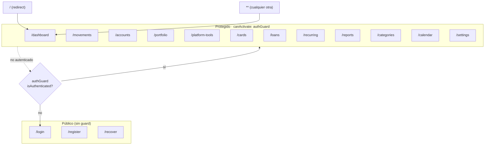
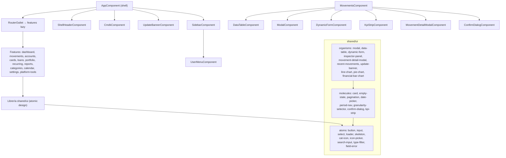
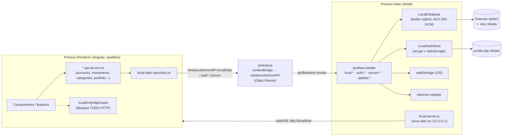
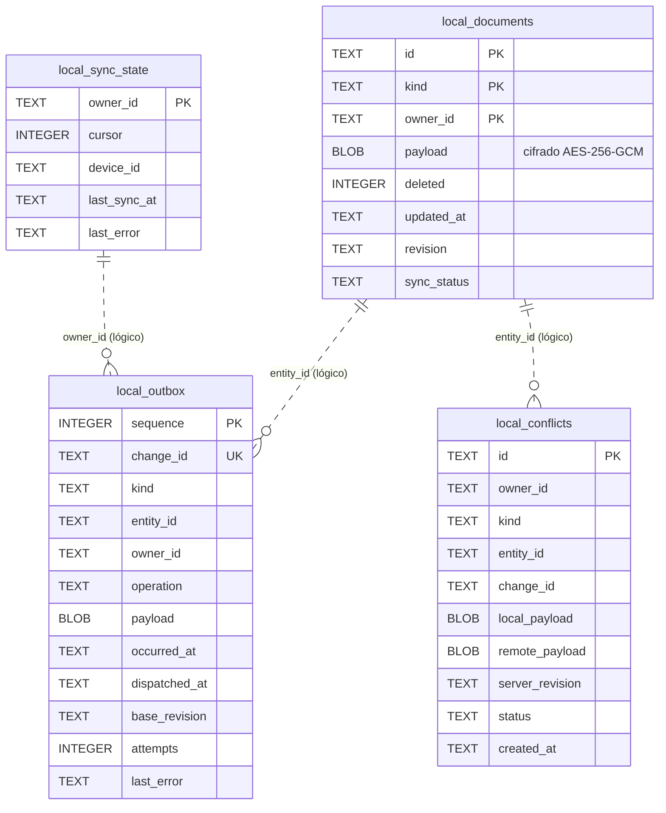

# Auditoría del proyecto `finanzas-desktop`

Fecha: 2026-08-15 · Rama: `main` · Stack: Angular 22 (standalone/signals) + Electron 33 + better-sqlite3

---

## Sección 1 — Resumen ejecutivo

El proyecto está **notablemente bien construido**. La capa Electron aplica prácticamente todas las buenas
prácticas de seguridad (sandbox, `contextIsolation`, `nodeIntegration` off, CSP con nonce, `safeStorage`,
cifrado AES-256-GCM de los documentos, autenticación con scrypt + bloqueo por intentos + comparación en tiempo
constante). El front usa standalone components, `ChangeDetectionStrategy.OnPush` en todos lados, signals,
`takeUntilDestroyed` para las suscripciones y rutas *lazy*. Todo el tráfico HTTP está bloqueado por un
interceptor (app 100% local).

**Dos observaciones que cambian el alcance del trabajo pedido:**

- 🟢 **Los comentarios ya NO existen.** No hay ni un solo comentario en `src/` (`.ts`, `.html`, `.css`) ni en
  `electron/` (`.js`). Una pasada previa ya los eliminó. La tarea "eliminar todos los comentarios" es un
  **no-op**: no queda nada que borrar (solo dejó líneas en blanco huérfanas — ver F-03).
- 🟢 **La calidad ya es alta**, así que el "refactor de todo lo encontrado" es en la práctica una lista corta de
  arreglos concretos, no una reescritura.

**Los 3 riesgos más graves:**

1. 🔴 **Suite de tests rota** (`financial-engine-contract.spec.ts`): importa un fixture borrado
   (`docs/refactor/fixtures/...`). `pnpm test` falla de base (1 suite; 128 tests sí pasan).
2. 🟠 **395 warnings de lint preexistentes** (casi todos fin de línea CRLF/LF inconsistente).
3. 🟡 **Errores silenciados** en varios `catch {}` / `error: () => {}`: fallos que nunca se registran.

---

## Sección 2 — Tabla de hallazgos

| # | Sev | Archivo:línea | Problema | Recomendación |
|---|-----|---------------|----------|---------------|
| F-01 | 🔴 | `src/app/shared/utils/financial-engine-contract.spec.ts:1` | Importa `../../../../../docs/refactor/fixtures/financial-engine-contract.json`, que **no existe** (la carpeta `docs/` fue borrada). Rompe `pnpm test`. | Restaurar el fixture, mover el JSON dentro de `src/` y repuntar el import, o retirar/omitir la suite si el contrato ya no aplica. |
| F-02 | 🟠 | Todo `src/` (395 warnings) | `pnpm lint` reporta 395 warnings `prettier/prettier`, en su mayoría `Insert ␍` (mezcla CRLF/LF) y algún formateo. 0 errores. | `pnpm format` + fijar `endOfLine` en Prettier y añadir `.gitattributes` (`* text=auto eol=lf`) para estabilizar finales de línea. |
| F-03 | 🟡 | p.ej. `electron/local-data/database.js:11`, `auth-store.js:36,61`, `app.routes.ts:15`, `financial-insights.component.ts:158` | Líneas en blanco huérfanas dejadas por el borrado previo de comentarios (a veces dentro de `catch {}` vacíos). | Eliminar las líneas en blanco sobrantes (lo hace `pnpm format` en gran parte). |
| F-04 | 🟡 | `shell/cmdk/cmdk.component.ts:65,69`; `auth.service.ts:114`; `financial-insights.component.ts:157`; varios | Errores tragados en silencio (`error: () => {}`, `catch {}`). Un fallo real queda invisible. | Registrar con `LoggerService`/`console` al menos en el `catch`, o comentar por qué se ignora. |
| F-05 | 🟡 | `electron/local-data/ipc.js:5-21` | Los handlers `local:*` confían en el `ownerId` que envía el renderer sin verificar contra la sesión autenticada. Un renderer comprometido podría leer datos de otro `ownerId`. | Defensa en profundidad: validar el `ownerId` contra la sesión activa del `LocalAuthStore` en el proceso main. |
| F-06 | 🟡 | `electron/local-data/database.js:107-135,137-182` | `movements()` carga y descifra **todos** los documentos y filtra en JS en cada consulta; `summary()` usa `pageSize` 100000; `accountBalances()` recarga todo por llamada. | Inherente al almacén cifrado, pero cachear la lista descifrada por `ownerId` o memoizar reduciría trabajo repetido. |
| F-07 | ⚪ | `src/app/shared/services/auth/session.service.ts:5-35,72-74` | El *fallback* v3 cifra el resume-token con una clave derivada de una constante y sal **hardcodeadas** → ofuscación, no secreto real. Solo se usa sin `electronAPI` (navegador). | Documentar que es *best-effort* fuera de Electron, o eliminar el camino v3 si la app solo corre en Electron. |
| F-08 | ⚪ | `electron/services/window.js:30` | `nativeWindowOpen: true` es una opción **obsoleta/no-op** en Electron moderno. | Eliminarla. |
| F-09 | ⚪ | `electron/services/local-server.js:23` | Intenta enlazar el puerto 80 primero (puede requerir privilegios; ya hace *fallback*). | Priorizar un puerto alto (p.ej. 4269) antes que 80. |
| F-10 | ⚪ | `src/app/shell/header/header.component.ts:17` | Mezcla estilos de API: `input.required()` (nuevo) junto a `@Output()` (decorador antiguo). | Migrar `@Output()` a la función `output()` para consistencia con el resto. |
| F-11 | ⚪ | `electron/services/security.js:4-6` | `secure:decrypt` devuelve `null` ante cualquier fallo sin distinguir "no disponible" de "token corrupto". | Suficiente para el uso actual; opcional diferenciar para telemetría. |

> Nota metodológica: la auditoría revisó en profundidad toda la capa `electron/`, el núcleo de auth/guard/
> interceptor/sesión del front y una muestra de componentes de features. Los hallazgos marcados son verificables
> en el código. No se detectaron `TODO/FIXME`, ni `any` peligrosos, ni `innerHTML` con datos de usuario (los
> `bypassSecurityTrustHtml` se usan solo con SVGs de catálogos estáticos).

---

## Sección 3 — Diagrama de navegación (rutas/pantallas)

## Sección 4 — Diagrama de componentes (jerarquía)

## Sección 5 — Diagrama de arquitectura

## Sección 6 — Diagrama de base de datos

Almacén **documental** cifrado (SQLite): cada fila guarda un `payload` **BLOB cifrado (AES-256-GCM)** indexado
por `kind` + `owner_id` + `id`. No hay claves foráneas físicas; la relación es lógica por `owner_id`/`entity_id`.

`kind` ∈ { movement, account, category, entity, portfolioentity, portfoliovaluation, investmenttransaction,
loan, budget, financialgoal, financialoperation, installmentpurchase, recurringtransaction }. Fuera de SQLite:
`profile.dat` (perfil/credenciales, cifrado con `safeStorage`) y `finanzas.sqlite3.key` (clave del DB, envuelta).

---

## Sección 7 — Plan de refactor (guía de la Fase 2)

Ordenado por prioridad. **La Fase 3 (borrar comentarios) queda sin trabajo**: ya no hay comentarios.

**Prioridad 🔴/🟠 (romper/CI):**
1. **F-01** — Reparar la suite `financial-engine-contract.spec.ts`: reubicar el fixture JSON dentro de `src/`
   (p.ej. `src/app/shared/utils/__fixtures__/financial-engine-contract.json`) y actualizar el import, para que
   `pnpm test` vuelva a verde. (Si el contrato ya no aplica, retirar la suite — a confirmar contigo.)
2. **F-02** — Normalizar formato/finales de línea: `pnpm format`, fijar `endOfLine` en la config de Prettier y
   añadir `.gitattributes` (`* text=auto eol=lf`). Objetivo: `pnpm lint` con 0 warnings.

**Prioridad 🟡 (calidad):**
3. **F-03** — Quitar líneas en blanco huérfanas del borrado previo de comentarios (parcialmente lo hace `format`).
4. **F-04** — Sustituir `catch {}` / `error: () => {}` silenciosos por registro con `LoggerService`.
5. **F-05** — Endurecer los handlers IPC `local:*` validando `ownerId` contra la sesión activa (defensa en profundidad).
6. **F-06** — (Opcional, perf) Memoizar/cachear la lista descifrada de `movement` por `ownerId` en `LocalDatabase`.

**Prioridad ⚪ (pulido):**
7. **F-08** — Eliminar `nativeWindowOpen: true` (obsoleto).
8. **F-10** — Migrar `@Output()` de `header.component.ts` a `output()`.
9. **F-09 / F-07 / F-11** — Ajustes menores según se decida.

**Verificación final (Fase 4):** `pnpm lint` → `pnpm build` → `pnpm test` → `pnpm test:electron`, todo en verde.
