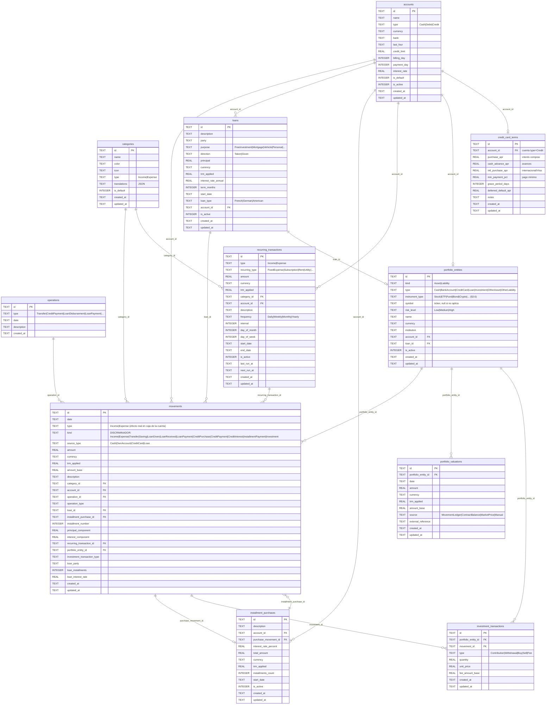

# Diseño de base de datos relacional (centrado en movimientos)

Propuesta para reemplazar el almacén documental cifrado actual (`local_documents` con `payload` BLOB) por un
**modelo relacional en claro**, con una tabla por entidad y relaciones reales, donde **`movements` es el libro
mayor central** de todo ingreso/egreso. A partir de él se derivan saldos, deuda y patrimonio.

Decisiones ya acordadas: relacional en texto plano · sin migración (desde cero) · quitar la capa de
sync/API anterior, los restos HTTP/environment y las entidades sin uso · **diseño primero**.

---

## 1. Filosofía: `movements` es la única fuente de verdad

- **`movements`** registra cada ingreso/egreso, con claves foráneas hacia todo lo relacionado (cuenta,
  categoría, préstamo, compra en cuotas, recurrente, entidad de portafolio, operación).
- Las **tablas de producto** (`accounts`, `loans`, `installment_purchases`, `portfolio_entities`) guardan solo
  la **definición/contrato**. Su **estado actual** (saldo de cuenta, deuda pendiente, cuotas pagadas, patrimonio
  neto) **se calcula desde `movements`**, no se almacena duplicado. Esto elimina inconsistencias.
- **Patrimonio** = activos/pasivos de `portfolio_entities` valuados por `portfolio_valuations`, más saldos
  derivados de cuentas y préstamos. Todo cuadra contra el libro mayor.

### 1.1 Organizado por un `kind` (tipo), sin tablas sueltas

Cada fila de `movements` se clasifica con **un solo discriminador `kind`** que dice *qué es* esa fila:

| `kind` | Qué representa | `direction` |
|--------|----------------|-------------|
| `Income` | Ingreso ordinario | Income |
| `Expense` | Egreso ordinario | Expense |
| `Transfer` | Transferencia entre cuentas (2 patas, mismo `operation_id`) | Neutral |
| `Saving` | Ahorro (movimiento a cuenta/entidad de ahorro) | Neutral |
| `LoanGiven` / `LoanReceived` | Desembolso de un préstamo dado/recibido | Neutral |
| `LoanPayment` | Pago de préstamo (con `principal_component` + `interest_component`) | Expense |
| `CreditPurchase` / `CreditPayment` / `CreditInterest` | Movimientos de tarjeta de crédito | según caso |
| `InstallmentPayment` | Pago de una cuota de una compra a plazos | Expense |
| `Investment` | Aporte/retiro/compra/venta/comisión de portafolio | Neutral |

`direction` (Income/Expense/Neutral) es el campo que usan los resúmenes para sumar sin ambigüedad.
Esto **reemplaza** las 5 columnas dispersas de hoy (`type`, `sub_type`, `source_type`, `operation_type`,
`investment_transaction_type`) por un tipo claro + campos específicos solo cuando aplican.

**Ninguna tabla queda aislada:** toda tabla de referencia se relaciona con `movements` por FK
(`account_id`, `category_id`, `loan_id`, `installment_purchase_id`, `recurring_transaction_id`,
`portfolio_entity_id`, `operation_id`) o cuelga de una entidad que sí se relaciona (p.ej.
`portfolio_valuations → portfolio_entities`). No hay tablas "por su cuenta".

### 1.2 Enums (tipos cerrados) — se validan en la capa de datos

| Enum | Valores |
|------|---------|
| `MovementKind` | Income · Expense · Transfer · Saving · LoanGiven · LoanReceived · LoanPayment · CreditPurchase · CreditPayment · CreditInterest · InstallmentPayment · Investment |
| `Direction` | Income · Expense · Neutral |
| `SourceType` | Cash · OwnAccount · CreditCard · Loan |
| `AccountType` | Cash · Debit · Credit |
| `CategoryType` | Income · Expense |
| `OperationType` | Transfer · CreditPurchase · CreditInterest · CreditPayment · LoanDisbursement · LoanPayment · Saving |
| `LoanType` | French · German · American |
| `LoanPurpose` | FreeInvestment · Mortgage · Vehicle · Personal · Education · Other |
| `LoanDirection` | Taken (yo debo) · Given (me deben) |
| `RecurringType` | FixedExpense · Subscription · Rent · Utility · Salary · Other |
| `InstrumentType` *(extensible, §3.6)* | Stock · ETF · Fund · Bond · Crypto · Cash · Other |
| `RiskLevel` | Low · Medium · High |
| `RecurrenceFrequency` | Daily · Weekly · Monthly · Yearly |
| `PortfolioEntityKind` | Asset · Liability |
| `PortfolioEntityType` | Cash · BankAccount · CreditCard · Loan · Investment · OtherAsset · OtherLiability |
| `PortfolioValuationSource` | MovementLedger · ContractBalance · MarketPrice · Manual |
| `InvestmentTransactionType` | Contribution · Withdrawal · Buy · Sell · Fee |

SQLite no tiene tipo ENUM nativo; se valida por `CHECK(...)` en la tabla y por TypeScript en la capa de acceso.

---

## 2. Diagrama entidad-relación propuesto

---

## 3. Notas por tabla (qué se guarda vs. qué se deriva)

- **movements** — núcleo. Clasificado por `kind` (§1.1) + `direction` para sumar. Multi-moneda: `amount` +
  `currency` + `trm_applied` → `amount_base` (moneda base del perfil). Índices: `date`, `kind`, `account_id`,
  `category_id`, `operation_id`, `loan_id`, `installment_purchase_id`, `portfolio_entity_id`. Los campos de
  display (`categoryName`, `categoryColor`, `accountName`, …) que hoy están en `MovementResponse` pasan a
  resolverse por **JOIN**, no se almacenan.
- **accounts** — definición de la cuenta. `balance`, `outstandingDebt`, `cycleSpend`, `usedInCycle` → **derivados**
  de `movements` (misma lógica que hoy `accountBalances()`), no columnas.
- **loans** — contrato del préstamo. Nuevos: `purpose` (libre inversión, hipotecario, vehículo…) y `direction`
  (`Taken` = yo debo / `Given` = me deben, préstamos que hago a terceros). `paidMonths`, `remainingMonths`,
  `paidPrincipal`, `outstandingPrincipal` → **derivados** de los `movements` de pago (`loan_id`,
  `kind='LoanPayment'`, `principal_component`).
- **installment_purchases** — contrato de la compra a cuotas. `paidCount`, `monthlyAmount`, `remainingAmount` →
  **derivados**. El **cronograma/extracto simulado por compra con su interés** se calcula en `v_installment_schedule`.
- **credit_card_terms** (NEW) — reglas propias de cada tarjeta (`account_id` type=Credit): interés de compras,
  avances, compras internacionales/Visa, pago mínimo, días de gracia. Alimenta la simulación de extracto
  (`v_credit_card_statement`). Una tarjeta = una fila de términos.
- **recurring_transactions** — nuevo `recurring_type` (gasto fijo, suscripción, arriendo, servicio…).
- **operations** — agrupa las operaciones de varias patas (transferencia = 2 movimientos, pago de tarjeta, etc.).
- **portfolio_entities / portfolio_valuations / investment_transactions** — patrimonio e inversiones. Nuevos en
  `portfolio_entities`: `instrument_type` (Stock/ETF/Fund…), `symbol` (ticker) y `risk_level`. Posición
  (cantidad, costo, valor de mercado, **ganancia/pérdida no realizada**) → **derivada** en `v_investment_positions`
  desde `investment_transactions` (Buy/Sell) + última valuación `MarketPrice`. `account_id`/`loan_id` reemplazan a
  los antiguos `legacyAccountId`/`legacyLoanId` como FKs reales.

**Relación circular controlada:** `movements.installment_purchase_id → installment_purchases` y
`installment_purchases.purchase_movement_id → movements`. Ambas son NULL-ables (se crea el movimiento de compra,
luego la compra a cuotas, luego se enlaza), así que no bloquea inserciones.

**Single-user:** al ser una app 100% local de un solo usuario, se elimina `owner_id`/`userId` de todas las
tablas. La identidad del usuario sigue viviendo en `profile.dat` (cifrado con `safeStorage`, capa de auth aparte).

---

## 3.5 Cálculos derivados → vistas SQL

Como el estado se **deriva** del ledger (D1), lo natural es exponerlo con **vistas SQL** (`CREATE VIEW`). Así la
lógica de negocio vive una sola vez, en la base, y la capa de datos solo consulta. Vistas propuestas:

| Vista | Qué calcula (desde `movements` + tablas de contrato) |
|-------|------------------------------------------------------|
| `v_account_balances` | Por cuenta: `balance` (Σ `direction=Income` − Σ `Expense` en moneda de la cuenta), `balance_base`, y para tarjetas `outstanding_debt`, `cycle_spend`/`used_in_cycle` según `billing_day`. Reemplaza a `accountBalances()`. |
| `v_loan_status` | Por préstamo: `paid_principal` (Σ `principal_component` de `kind=LoanPayment`), `paid_interest`, `outstanding_principal = principal − paid_principal`, `paid_months`, `remaining_months`. |
| `v_installment_status` | Por compra a cuotas: `paid_count` (nº de `kind=InstallmentPayment`), `paid_amount`, `remaining_amount = total_amount − paid_amount`, `monthly_amount`. |
| `v_monthly_summary` | Por `año-mes`: `total_income`, `total_expense`, `savings`, `balance`, `savings_rate` usando `direction` (excluye Neutral). Reemplaza a `summary()`. |
| `v_net_worth` | Patrimonio: Σ activos − Σ pasivos desde `portfolio_entities` + su última `portfolio_valuation` (o saldo derivado si la fuente es `MovementLedger`). |
| `v_credit_card_statement` | Extracto simulado por tarjeta y ciclo: consumos del ciclo + interés según `credit_card_terms` (compras/avances/internacional), pago mínimo, saldo. |
| `v_installment_schedule` | Cronograma de amortización por compra a cuotas: cuota, capital, interés y saldo mes a mes con su `interest_rate_percent`. |
| `v_investment_positions` | Por posición: cantidad, costo promedio, valor de mercado, **ganancia/pérdida no realizada** y `risk_level`. |
| `v_net_worth_history` | Patrimonio neto **por fecha** (serie temporal), a partir de las `portfolio_valuations`; permite ver la evolución (ventas, cambios). |

### 3.6 Extensibilidad (agregar tipos sin rehacer)

Para poder **crecer** (nuevos instrumentos como ETF, nuevos propósitos de préstamo, etc.) sin migraciones dolorosas:

- Los tipos **muy estables** (kind, direction, loan_type…) van como `CHECK(...)` + enum TS: agregar un valor es
  una línea + una migración de Drizzle.
- Los tipos **que crecerán a menudo** — sobre todo `instrument_type` de inversiones (Stock, ETF, Fund, Crypto…)
  — se modelan con una **tabla de catálogo** `instrument_types(code PK, label, is_active)` referenciada por FK.
  Así agregas un tipo **en tiempo de ejecución** (una fila), sin tocar el esquema.
- Las vistas derivadas no asumen un catálogo cerrado, para que un tipo nuevo aparezca sin cambiarlas.

Reglas clave a preservar del motor actual: conversión `amount × trm_applied = amount_base` a moneda base;
ciclos de tarjeta por `billing_day`; interés vs. principal en pagos de préstamo; exclusión de `Transfer`/`Saving`
(Neutral) de ingresos/egresos ordinarios.

---

## 4. Qué se elimina

**Base de datos / proceso main:**
- Tablas y toda su maquinaria: `local_documents`, `local_outbox`, `local_sync_state`, `local_conflicts`.
- Métodos de sync en `LocalDatabase`: `outbox`, `syncStatus`, `ensureDevice`, `recordPushResults`,
  `recordSyncError`, `applyRemotePage`, `conflicts`, `importServerConflicts`, `resolveConflict`, y columnas
  `revision`/`sync_status`/`base_revision`/`attempts`/`change_id`/`dispatched_at`.
- **Cifrado de payload** (`#encrypt`/`#decrypt`/`#loadKey` + fichero `.key`): al ser columnas en claro, ya no
  aplica. (El cifrado de `profile.dat` para auth se mantiene.)
- Entidades sin uso: `entity`, `financialoperation`, `budget`, `financialgoal`.

**Front-end / renderer:**
- Interceptor `local-only-http-guard` y el `provideHttpClient` asociado; restos de `apiUrl`/environment de servidor.
- En `local-data.repository.ts`: el parámetro `operation`/`'snapshot'` y los tipos de sync; se simplifica la API
  a CRUD directo por entidad.
- Los canales IPC pasan de `local:list/get/put/...` genéricos por `kind` a operaciones tipadas por entidad
  (o se mantiene un CRUD genérico pero contra tablas reales — ver decisión D3).

---

## 5. Decisiones abiertas para consolidar

- **D1 — Progreso derivado vs. almacenado.** Propongo **derivar** `paidCount`, saldos y deuda desde `movements`
  (cero duplicación, siempre cuadra). Alternativa: cachear en columnas por rendimiento. Recomiendo derivar.
- **D2 — Quitar HttpClient por completo.** La app no hace HTTP. Propongo **eliminar** `HttpClient` + interceptor
  del bootstrap (en vez de dejar el interceptor bloqueando). Recomiendo eliminar.
- **D3 — Todo orientado a `movements`, organizado por `kind` (reformulado).** El acceso a datos es
  **movimiento-céntrico**: las consultas parten del ledger y traen lo relacionado por JOIN. Las tablas de
  referencia (accounts, categories, loans, installments, recurring, portfolio) se mantienen **normalizadas pero
  siempre enlazadas** a `movements` (§1.1); no hay tablas sueltas. La capa técnica de acceso será un CRUD
  genérico tipado (mapa entidad→tabla) para no reescribir todos los `*-api.service.ts`, pero el modelo mental y
  las consultas de negocio giran alrededor de `movements`.
  **Resuelto:** `loans` / `installment_purchases` / `recurring_transactions` se mantienen como **tablas propias
  normalizadas** (con sus atributos de contrato: tasa, plazo, frecuencia), cada una enlazada a `movements` por
  FK. El contrato vive una sola vez; los pagos son `movements` (`kind=LoanPayment`/`InstallmentPayment`) que
  apuntan a él.

- **D4 — ORM: Drizzle (resuelto).** Se usa **Drizzle ORM** sobre `better-sqlite3`: esquema tipado en TypeScript,
  migraciones con `drizzle-kit`, síncrono y ligero dentro del proceso main. (Prisma se descartó por su query
  engine nativo y los problemas de empaquetado en Electron.) Las **vistas** (`v_*`) se definen como SQL en las
  migraciones; Drizzle las consulta como relaciones de solo lectura.

---

## 6. Alcance de implementación (tras aprobar el diseño)

1. Añadir **Drizzle** + `drizzle-kit`; definir el esquema (12 tablas: las 9 base + `operations`,
   `credit_card_terms`, `instrument_types`) y las vistas `v_*` como SQL en la primera migración.
2. Reescribir `electron/local-data/database.js` sobre Drizzle: CRUD por tabla + consultas a las vistas derivadas
   (saldos, resumen, patrimonio, extracto de tarjeta, cronograma de cuotas, posiciones, patrimonio histórico).
3. Ajustar `ipc.js` y `preload.js` a la nueva API; adaptar `local-data.repository.ts` y los `*-api.service.ts`.
4. Enriquecer el dominio: `loans` (purpose/direction), `credit_card_terms`, `recurring_type`, inversiones
   (instrument_type/symbol/risk_level) y las vistas nuevas.
5. Quitar sync, HttpClient/interceptor, entidades sin uso; actualizar tests (`database.test.js`, specs) al
   esquema relacional.
6. Verificar: `pnpm lint` → `pnpm build` → `pnpm test` → `pnpm test:electron`.

> El refactor previo (F-01…F-11 de `AUDITORIA.md`) queda **en pausa**; parte de sus hallazgos (F-05 owner-check,
> F-06 caché) quedan **obsoletos** con este rediseño. F-01 (test roto) y F-02 (lint) siguen vigentes y se
> resuelven dentro de este trabajo.
